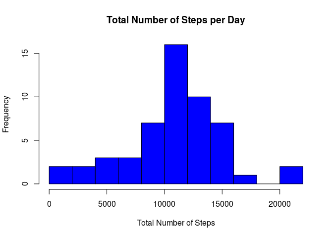
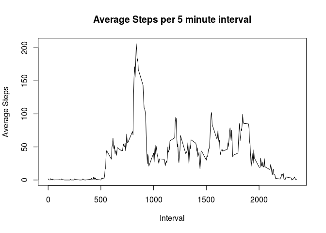
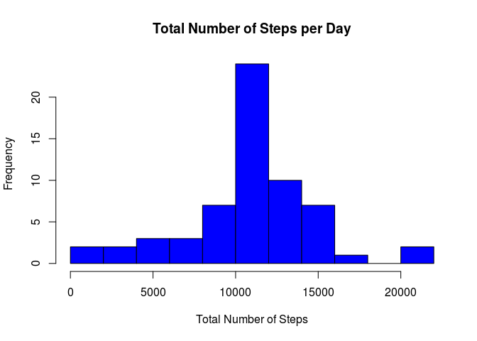
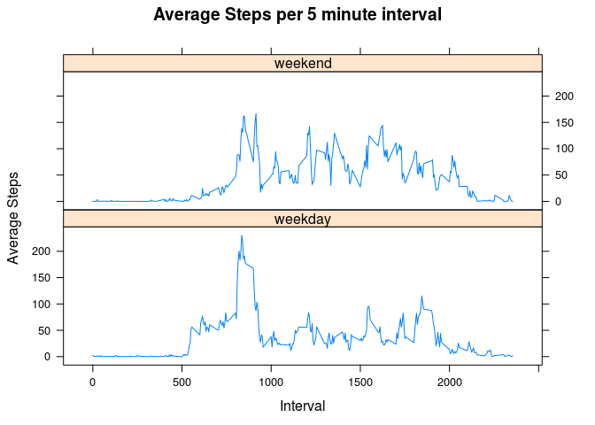

knitr::opts_chunk$set(echo = TRUE)


## Loading and preprocessing the data

```r
library(dplyr)
```

```
## 
## Attaching package: 'dplyr'
```

```
## The following objects are masked from 'package:stats':
## 
##     filter, lag
```

```
## The following objects are masked from 'package:base':
## 
##     intersect, setdiff, setequal, union
```

```r
activity_data <-read.csv("activity.csv", sep=",", header=TRUE)

clean_data <- activity_data[complete.cases(activity_data), ]
clean_data$date <- as.Date(clean_data$date)
```

## What is mean total number of steps taken per day?

### 1. calculate total steps per day (There are 53 days with recorded data)

```r
data_by_day <- group_by(clean_data, date)

steps_by_day <- data_by_day %>% summarise(
  		 steps = sum(steps),  )	
```

### 2. make histogram of steps per day

```r
main_title = "Total Number of Steps per Day"	 
x_label = "Total Number of Steps"
hist(steps_by_day$steps, col="blue", breaks=10,  main=main_title, xlab=x_label)
```

<!-- -->

### 3. Calculate and report mean & median

```r
mean_steps = mean(steps_by_day$steps)
median_steps = median(steps_by_day$steps)

mean_steps
```

```
## [1] 10766.19
```

```r
median_steps
```

```
## [1] 10765
```

## What is the average daily activity pattern?

```r
data_by_interval <- group_by(clean_data, interval)
steps_by_interval <- data_by_interval %>% summarise(
  		 mean = mean(steps), sum=sum(steps), )	
```

### 1. plot of the 5-minute interval (x-axis) and the average number of steps taken, averaged across all days (y-axis)

```r
with(steps_by_interval , plot(interval, mean, type="l", main="Average Steps per 5 minute interval", xlab="Interval", ylab="Average Steps"))
```

<!-- -->

### 2. Which 5-minute interval, on average across all the days in the dataset, contains the maximum number of steps?

```r
steps_by_interval[which.max(steps_by_interval$mean),]
```

```
## # A tibble: 1 x 3
##   interval  mean   sum
##      <int> <dbl> <int>
## 1      835  206. 10927
```

## Imputing missing values

### 1.Calculate and report the total number of missing values in the dataset (i.e. the total number of rows with NAs)

```r
sum(rowSums(is.na(activity_data)))
```

```
## [1] 2304
```

### 2. Devise a strategy for filling in all of the missing values in the dataset. The strategy does not need to be sophisticated. For example, you could use the mean/median for that day, or the mean for that 5-minute interval, etc.

#### Use floor(mean(steps)) for given 5-minute interval to fill the 2304 missing step counts

### 3. Create a new dataset that is equal to the original dataset but with the missing data filled in.

```r
library(DataCombine)

steps_by_interval$floor_mean <- as.integer(floor(steps_by_interval$mean))

fill_df <- data.frame(steps_by_interval$interval, steps_by_interval$floor_mean)
names(fill_df)<-c("interval","floor_mean")

new_data <- FillIn(D1 = activity_data, D2 = fill_df, 
                       Var1 = "steps", Var2 = "floor_mean", KeyVar = c("interval"))
```

```
## 2304 NAs were replaced.
```

```r
new_data <- new_data[order(new_data$date, new_data$interval),]

new_data <- new_data[c("steps", "date", "interval")]
new_data$date <- as.Date(new_data$date)

new_data_by_day <- group_by(new_data, date)

new_steps_by_day <- new_data_by_day %>% summarise(
  		 steps = sum(steps),  )	
```

### 4. Make a histogram of the total number of steps taken each day and Calculate and report the mean and median total number of steps taken per day. Do these values differ from the estimates from the first part of the assignment? What is the impact of imputing missing data on the estimates of the total daily number of steps?


```r
main_title = "Total Number of Steps per Day"	 
x_label = "Total Number of Steps"
hist(new_steps_by_day$steps, col="blue", breaks=10,  main=main_title, xlab=x_label)
```

<!-- -->

```r
new_mean_steps = mean(new_steps_by_day$steps)
new_median_steps = median(new_steps_by_day$steps)
new_mean_steps
```

```
## [1] 10749.77
```

```r
new_median_steps
```

```
## [1] 10641
```

```r
new_mean_steps - mean_steps
```

```
## [1] -16.41819
```

```r
new_median_steps - median_steps
```

```
## [1] -124
```

## Are there differences in activity patterns between weekdays and weekends?

```r
new_data$part_of_week <- ifelse(weekdays(new_data$date) %in% c("Saturday", "Sunday"), "weekend", "weekday")

new_data_by_weekday <- new_data %>% group_by(part_of_week, interval) %>% 
	     		summarise( total_steps = sum(steps), average_steps=mean(steps) )	
 
new_data_by_weekday$part_of_week <- as.factor(new_data_by_weekday$part_of_week)

library(lattice)
xyplot(average_steps ~ interval | part_of_week, data=new_data_by_weekday, layout=c(1,2), type="l",  main="Average Steps per 5 minute interval", xlab="Interval", ylab="Average Steps" )
```

<!-- -->
